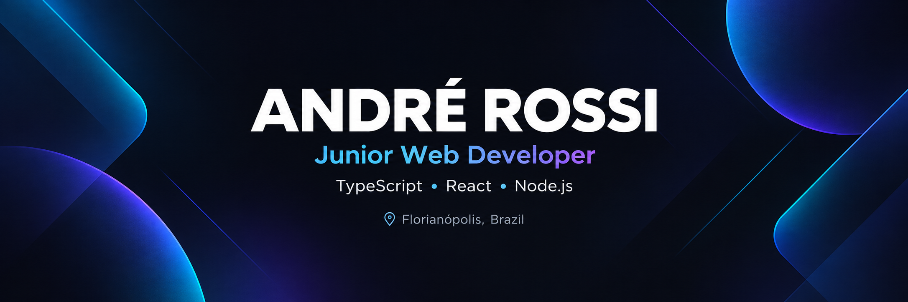

 

### 👋 Hi! I'm André Rossi

Junior Web Developer focused on building modern web applications with **TypeScript, React and the JavaScript ecosystem**.

---

## 👨‍💻 About Me

I'm a Software Development graduate based in Florianópolis, Brazil, focused on building my career in **Front-end and Full Stack Web Development**.

I enjoy learning through practical projects and turning concepts into real applications while continuously improving my development workflow and code quality.

- 💻 Focused on **Front-end / Full Stack Development**
- 🌱 Currently improving my **React, TypeScript and Next.js** skills
- 🚀 Building practical projects for my development portfolio
- 🎯 Looking for an opportunity as a **Junior Developer**
- 🌎 Advanced English
- 📍 Florianópolis, SC — Brazil

---

## 🎯 Current Focus

---

## 🛠️ Tech Stack

### Web Development

### Other Experience

### Tools

---

## 🚀 Featured Projects

### 📘 TypeScript Fundamentals

Repository documenting my TypeScript learning journey through practical examples and exercises organized by topic and lesson.

**Topics covered:**

`Type System` • `Union Types` • `Narrowing` • `Interfaces` • `Generics` • `Utility Types` • `Type Guards` • `Git Workflow`

---

### ⚛️ React + TypeScript Projects

I'm currently expanding my portfolio with projects focused on **React, TypeScript and modern web development**.

More projects coming soon. 🚀

---

## 📫 Let's Connect

---

### Building, learning and improving one project at a time. 🚀

